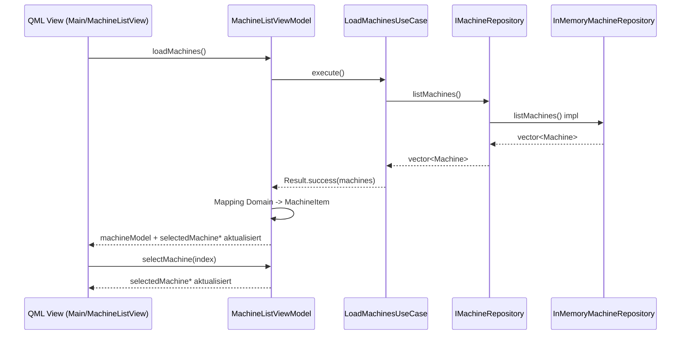
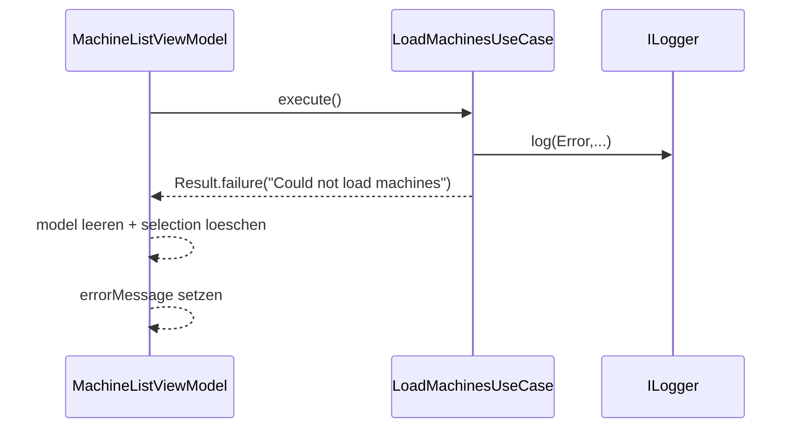

# 09 Datenfluss (Sequenzdiagramm)

## End-to-End: Maschinen laden und anzeigen

```mermaid
sequenceDiagram
    participant QML as QML View (Main/MachineListView)
    participant VM as MachineListViewModel
    participant UC as LoadMachinesUseCase
    participant REPO as IMachineRepository
    participant IMPL as InMemoryMachineRepository

    QML->>VM: loadMachines()
    VM->>UC: execute()
    UC->>REPO: listMachines()
    REPO->>IMPL: listMachines() impl
    IMPL-->>REPO: vector<Machine>
    REPO-->>UC: vector<Machine>
    UC-->>VM: Result.success(machines)
    VM->>VM: Mapping Domain -> MachineItem
    VM-->>QML: machineModel + selectedMachine* aktualisiert

    QML->>VM: selectMachine(index)
    VM-->>QML: selectedMachine* aktualisiert
```

## Fehlerpfad

```mermaid
sequenceDiagram
    participant VM as MachineListViewModel
    participant UC as LoadMachinesUseCase
    participant LOG as ILogger

    VM->>UC: execute()
    UC->>LOG: log(Error,...)
    UC-->>VM: Result.failure("Could not load machines")
    VM-->>VM: model leeren + selection loeschen
    VM-->>VM: errorMessage setzen
```
